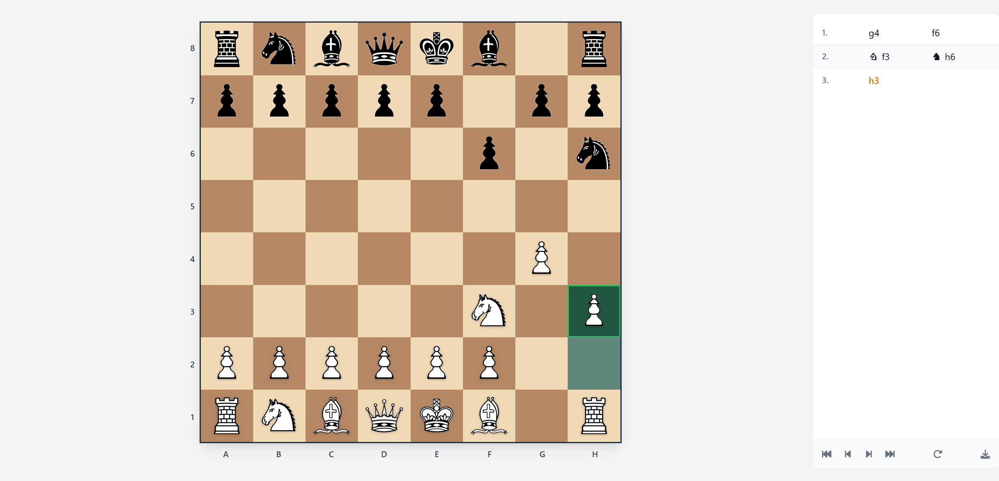
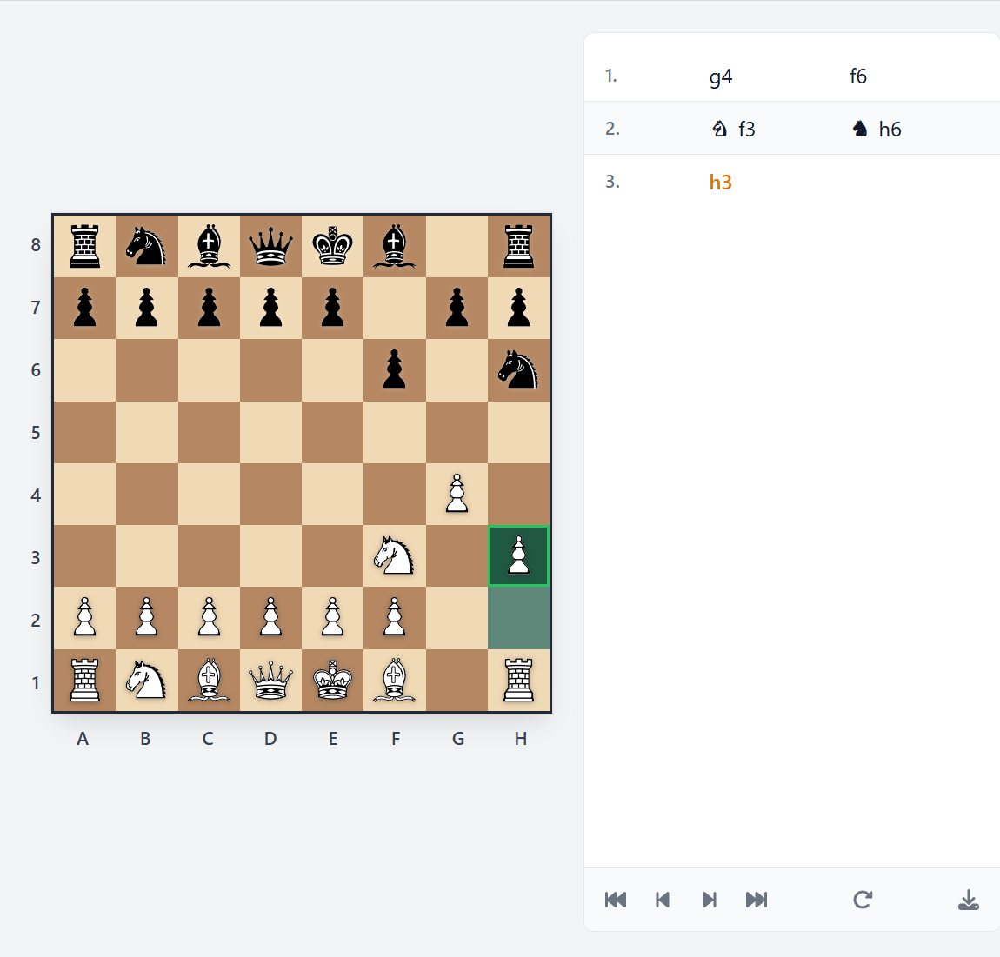
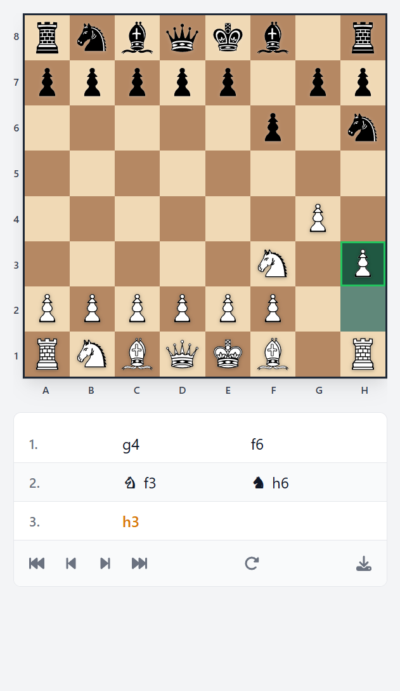

# Chess Board

A responsive, interactive chess board built with Vue 3 — a personal hobby project for playing through games, reviewing moves, and exporting PGN.



## Features

- **Playable board** — Drag and drop pieces with legal move validation (all standard piece rules plus castling).
- **Move history** — Sidebar lists moves in PGN-style notation; click a move to jump to that position.
- **Replay controls** — Step backward/forward through the game or jump to start/end.
- **PGN export** — Download the current game as a `.log` file.
- **Responsive layout** — Board and sidebar adapt to screen size; sidebar sits to the right on desktop and below the board on smaller screens.
- **Persistence** — Move history is saved in the browser so you can continue later.

## Screenshots

| Desktop                                 | Tablet                                        | Mobile                                        |
| --------------------------------------- | --------------------------------------------- | --------------------------------------------- |
|  |  |  |

## Tech stack

- **Vue 3** (Composition API, `<script setup>`)
- **Pinia** (state)
- **TypeScript**
- **Vite**
- **Tailwind CSS**

## Getting started

```bash
# Install dependencies
npm install

# Run dev server
npm run dev

# Build for production
npm run build

# Preview production build
npm run preview
```

## Scripts

| Script               | Description                      |
| -------------------- | -------------------------------- |
| `npm run dev`        | Start development server         |
| `npm run build`      | Production build                 |
| `npm run preview`    | Preview production build locally |
| `npm run lint`       | Lint and fix                     |
| `npm run format`     | Format with Prettier             |
| `npm run type-check` | TypeScript check                 |

## License

MIT
